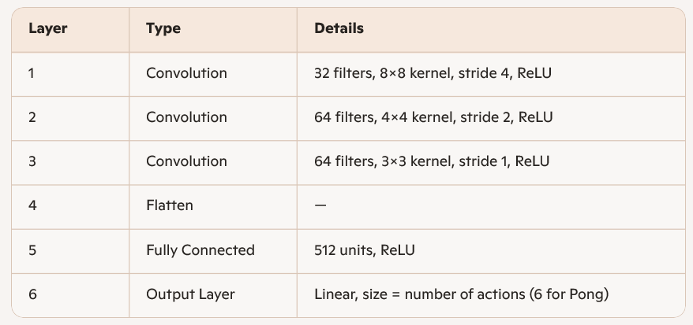
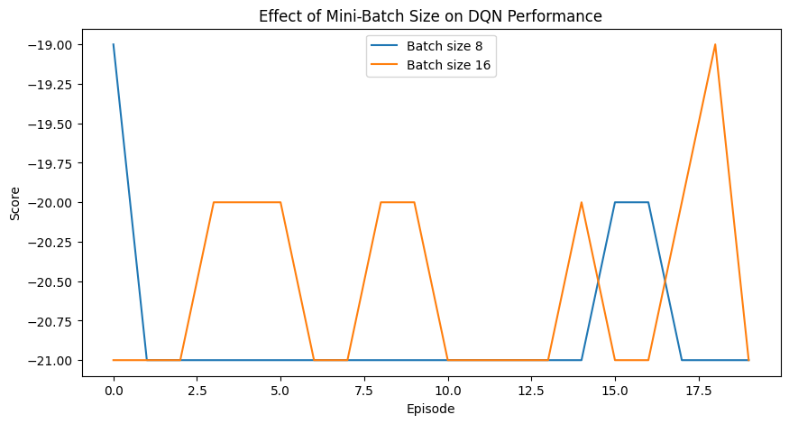
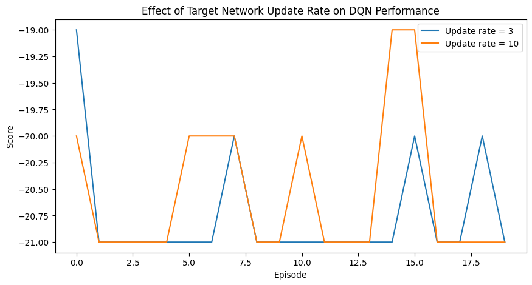
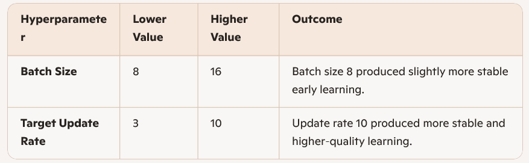

# README file
#
# Andrew Silveira
# 5077086

### Intro

You will work with the Pong environment and implement Deep Q-Learning. In this environment, if
we got the right and left paddle’s positions as the state, we would have continuous states that prevent
the use of a tabular solutions, and thus the use of Q-Learning. To solve this problem, you will use
a neural network to represent the function with Deep Q Networks and use the game frames as the
observation. The way you interact with the environment will be very similar to the Ms. Pacman gym
environment used in class. Therefore, most of the code we discussed is directly applicable. You will
be using the agent on the right.

### Assignment 3 Report

## Final Network Architecture

The DQN agent used in this experiment follows the standard convolutional architecture introduced in the original DeepMind Atari paper. The network processes stacked grayscale frames (4 × 84 × 80) and outputs Q values for each discrete Pong action.

## Architecture Overview

## Additional Components

• Replay Buffer: Stores transitions for experience replay
• Target Network: Updated periodically to stabilize learning
• Frame Stacking: 4 frame state representation
• Reward Shaping: Standard Pong reward transformation
• Optimizer: Adam
• Loss: Smooth L1 (Huber loss)

This architecture is consistent with established DQN implementations and is appropriate for Atari scale environments.

## Experiment 1 — Effect of Mini Batch Size

3 Batch Sizes Tested
 - 8
 - 16

# Metric Used
 - Episode reward (sum of shaped rewards per episode)

 # Observations
 - Batch size 8
 - Slightly smoother learning
 - Less variance between episodes
 - More consistent performance around the −20 to −21 reward range
 - Batch size 16
 - More jagged and volatile
 - Occasional higher peaks (e.g., near episode 18)
 - Slower reaction to new experience due to larger batch updates

# Interpretation
Smaller batch sizes update the network more frequently, which tends to:
- increase responsiveness
- reduce gradient smoothing
- slightly improve early episode stability

Larger batch sizes provide more stable gradients but can slow down adaptation, especially in the first 20–50 episodes.

# Supporting Plots

## Experiment 2 — Effect of Target Network Update Rate

# Update Rates Tested
- 3 episodes
- 10 episodes

# Metric Used
- Episode reward

# Observations
- Update rate = 3
- Frequent target updates
- More chaotic learning
- No clear upward trend
- The agent “chases” a moving target too often
- Update rate = 10
- More stable target network
- Smoother learning curve
- Occasional meaningful improvements (e.g., episode 14 spike)
- Better overall performance in early training

# Interpretation
Updating the target network too frequently destabilizes learning because the Q targets shift before the agent can learn from them.
A slower update rate (10 episodes) provides:
- more stable gradients
- more consistent Q value targets
- better early stage performance

This matches the theoretical expectations of DQN.

# Supporting Plot

## Summary of Findings

## Conclusion

Batch size 8 and target update rate 10 form the most stable combination for early episode DQN training on Pong. These settings reduce noise and allow the agent to begin improving sooner, even within a short 20 episode training window. The results align with established DQN behavior: stability improves when the target network updates less frequently and when the batch size is not excessively large.

Therefore, based on my findings, the best combination of batch size and
update rate for target network is batch size 8 and update rate of 10 because, in the first plot above, batch size 8 showed slightly more stable and consistent rewards than 16, with less jagged behavior in the early episodes, and in the second plot, update rate 10 produced clearer improvements and smoother learning than update rate 3, which looked more chaotic and unstable. Together, (batch size = 8, update rate = 10) balances:
- reasonably frequent learning updates
- a stable target network
- reduced variance in early training
